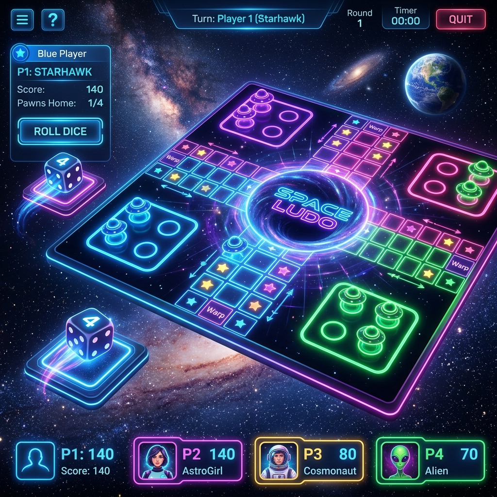

# Ram Prakash - Developer Portfolio Website

A modern, responsive, and visually stunning portfolio web application built with **React**, **TypeScript**, **Vite**, and **Tailwind CSS**. It showcases engineering projects, technical skill sets, professional work experience, and contact forms.



---

## ✨ Features

- 🌟 **Dynamic UI & Glassmorphism Design**: Sleek dark-mode aesthetic with smooth scrolling, interactive cards, and micro-animations.
- 📱 **Fully Responsive**: Optimized for desktop, tablet, and mobile displays.
- 🚀 **Featured Projects Showcase**: Detailed interactive cards highlighting project role, status, key outcomes, and tech stacks.
- 💼 **Professional Experience Timeline**: Interactive career roadmap featuring TCS and Mentor Friends achievements.
- 🛠️ **Categorized Skills Matrix**: Technical skills grouped by Frontend, Backend, Database, Cloud & DevOps, Data Science, and Design.
- 📬 **Interactive Contact Form**: Direct message integration.

---

## 🛠️ Technology Stack

- **Framework**: React 18
- **Language**: TypeScript
- **Build Tool**: Vite
- **Styling**: Vanilla CSS & Custom Design System (`index.css`) / Tailwind CSS
- **Icons**: Lucide React (`lucide-react`)
- **Deployment**: Vercel / GitHub Pages

---

## 📂 Featured Projects Catalog

### 1. 🚀 Space Ludo — Android Sci-Fi Board Game
- **Technologies**: Kotlin, Jetpack Compose, HTML5/Canvas, JavaScript, Firebase Realtime DB, Web Audio API
- **Repository**: [i-am-ramprakash/kids-fun-ludo](https://github.com/i-am-ramprakash/kids-fun-ludo)
- **Description**: A sci-fi themed Ludo board game with Jetpack Compose native shell, HTML5/Canvas rendering engine, custom power-up systems, mini-games, and real-time multiplayer.

### 2. 🇩🇪 DeutschSpaß — German Language Platform
- **Technologies**: React, TypeScript, Tailwind CSS, Zustand, Supabase, Web Speech API
- **Repository**: [i-am-ramprakash/German-Language-Learning-App-UI](https://github.com/i-am-ramprakash/German-Language-Learning-App-UI)
- **Description**: CEFR-aligned (A1–B2) Goethe exam preparation platform featuring structured unit roadmaps, timed mock exam simulations, Spaced Repetition (SRS) vocabulary review, and gamified progress loops.

### 3. 💕 MuTu — Long-Distance Relationship Companion
- **Technologies**: React, TypeScript, Express, Firebase Firestore, WebRTC, Google Gemini AI, WebSockets
- **Repository**: [i-am-ramprakash/mutu-for-couple](https://github.com/i-am-ramprakash/mutu-for-couple)
- **Description**: Private, end-to-end encrypted companion platform for long-distance couples featuring real-time WebRTC audio/video calls, Gemini AI love assistant, shared polaroid wall, and synchronized activities.

### 4. 🧠 Alzheimer's Disease Detection from MRI
- **Technologies**: Python, TensorFlow, CNN, OpenCV
- **Repository**: [i-am-ramprakash/Alzheimer-s-Disease-Detection-from-MRI](https://github.com/i-am-ramprakash/Alzheimer-s-Disease-Detection-from-MRI)
- **Description**: AI-powered medical diagnosis system using Convolutional Neural Networks (CNN) with TensorFlow for early detection of Alzheimer's disease from brain MRI scans.

### 5. 🔒 Secure Cloud Storage Using Blockchain
- **Technologies**: Blockchain, AES Encryption, SHA-512, Node.js
- **Repository**: [i-am-ramprakash/Enhancing-Security-of-Data-in-Cloud-Storage-using-Decentralized-Block-chain](https://github.com/i-am-ramprakash/Enhancing-Security-of-Data-in-Cloud-Storage-using-Decentralized-Block-chain)
- **Description**: Decentralized cloud storage solution integrating client-side AES encryption, SHA-512 integrity verification, and blockchain nodes.

### 6. ✈️ Java/J2EE Enterprise Web Application
- **Technologies**: Java, Spring Boot, Hibernate, REST API
- **Repository**: [i-am-ramprakash/Airline-Booking-System](https://github.com/i-am-ramprakash/Airline-Booking-System)
- **Description**: Full-stack enterprise web application built during Wipro internship with Spring Boot, Hibernate, and RESTful services.

---

## 🚀 Getting Started

### Prerequisites

Ensure you have [Node.js](https://nodejs.org/) (v18+) installed.

### Installation

```bash
# Clone the repository
git clone https://github.com/i-am-ramprakash/portfolio-website.git

# Navigate to the directory
cd portfolio-website

# Install dependencies
npm install
```

### Running Locally

```bash
# Start development server
npm run dev
```

Open [http://localhost:5173](http://localhost:5173) in your browser.

### Building for Production

```bash
# Compile TypeScript and build production bundle
npm run build
```

The output will be generated in the `dist/` directory ready for deployment.